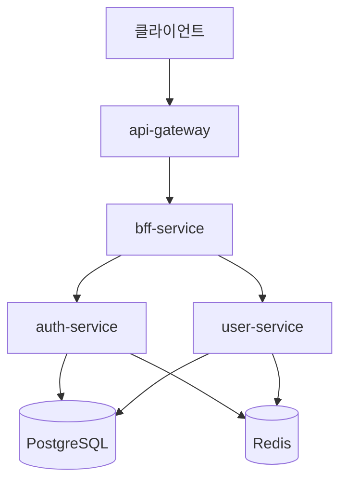
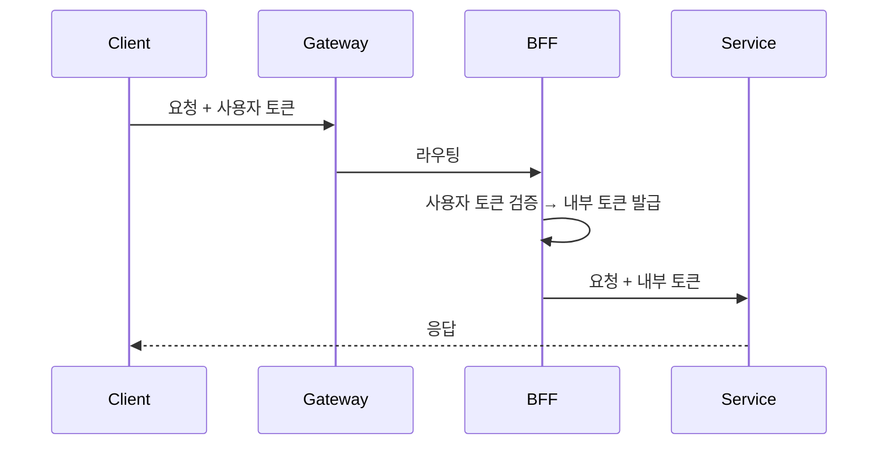

# NextMall


대규모 트래픽 처리, 분산 시스템 설계 등 **실무에서 경험하기 어려운 영역을 학습**하기 위한 이커머스 플랫폼 프로젝트입니다.

> 실제 서비스 목적이 아닌 **기술 학습**이 주목적이며, 설계 원칙은 **실무 기준 베스트 프랙티스**를 지향합니다.

---

## 프로젝트 목적

이 프로젝트의 목적은 "완성된 서비스"가 아니라 **설계 선택의 이유를 설명할 수 있는 백엔드 개발자로 성장**하는 것입니다.

- 실무에서 직접 다뤄보지 못한 기술과 아키텍처를 설계 관점에서 체득
- 단순 CRUD가 아닌, 경계 / 통신 / 실패 / 보안을 고려한 구조 연습
- GitHub Issue + PR + 리뷰 기반의 실무형 개발 프로세스 시뮬레이션
- AI(CodeRabbit, Claude)와 협업하는 개발 방식 실험

---

## 아키텍처

NextMall은 **마이크로서비스 아키텍처**를 채택하고 있습니다. 각 서비스는 독립적으로 배포 가능하며, 명확한 책임 경계를 가집니다.

> 학습 목적의 프로젝트로, 서비스 간 통신 / 인증 위임 / 장애 격리 등 MSA 환경에서 발생하는 문제들을 직접 경험하기 위해 의도적으로 서비스를 분리했습니다.



### 서비스 구성

| 서비스 | 역할 |
|--------|------|
| **api-gateway** | 진입점. 토큰 존재여부 검증, 라우팅, Rate Limiting |
| **bff-service** | Backend for Frontend. 사용자 토큰 검증, 내부 토큰 발급, 서비스 호출 조합 |
| **auth-service** | 인증/인가. 로그인, 토큰 관리 |
| **user-service** | 회원 관리. 가입, 프로필 |

> **설계 노트**: 현재 BFF에서 서비스 호출 조합(오케스트레이션)을 담당합니다. 복잡도가 증가하면 Saga Orchestrator로 분리 가능한 구조입니다.

### 핵심 설계 원칙

| 원칙 | 설명 |
|------|------|
| **Gateway 책임 분리** | 토큰 존재여부만 검증, 상세 인증/인가는 하위 서비스에서 처리 |
| **Internal Token** | 서비스 간 통신 시 내부 토큰 발행하여 신뢰 구축 |
| **CQRS** | JPA(Command) + jOOQ(Query) 분리로 읽기/쓰기 최적화 |
| **단일 책임** | 개별 서비스는 단일 도메인만 담당, 복합 로직은 BFF에서 조율 |
| **이벤트 드리븐** | 서비스 간 강결합 방지를 위해 Kafka 도입 예정 |

### 내부 서비스 인증 (토큰 교환 패턴)

외부 사용자 토큰과 내부 서비스 토큰을 분리하여 보안과 신뢰를 확보합니다.



- **사용자 토큰**: Gateway/BFF에서만 검증
- **내부 토큰**: 서비스 간 통신용, 사용자 정보 포함, 짧은 만료 시간
- **헤더 분리**: `Authorization`(사용자) / `X-Internal-Authorization`(내부)

---

## 기술 스택

### Core

| 기술 | 버전 | 용도 |
|------|------|------|
| **Kotlin** | 2.2.x | 주 개발 언어 |
| **Java** | 21 | JVM 런타임 |
| **Spring Boot** | 4.0.1 | 애플리케이션 프레임워크 |
| **Gradle** | Kotlin DSL | 빌드 & 멀티 모듈 관리 |

### Data & Infrastructure

| 기술 | 용도 |
|------|------|
| **PostgreSQL** | 주 데이터베이스 |
| **Redis** | 캐시, 세션, 분산 락, Rate Limiting |
| **JPA (Hibernate)** | Command (쓰기) 작업 |
| **jOOQ** | Query (읽기) 작업 - CQRS |
| **Liquibase** | DB 마이그레이션 |

### Communication

| 기술 | 용도 |
|------|------|
| **Spring Cloud Gateway** | API Gateway (WebFlux 기반) |
| **Spring WebClient** | 서비스 간 HTTP 통신 |
| **Kafka** | 이벤트 메시징 (예정) |

### Test & Quality

| 기술 | 용도 |
|------|------|
| **JUnit 5** | 테스트 프레임워크 |
| **Kotest** | Kotlin 테스트 DSL |
| **MockK** | Mocking 라이브러리 |
| **Testcontainers** | 통합 테스트 (PostgreSQL, Redis) |
| **SonarQube** | 코드 품질 분석 |
| **Ktlint** | 코드 스타일 검사 |

---

## 프로젝트 구조

```
nextmall/
│
├── services/                    # 배포 단위 (Spring Boot Application)
│   ├── api-gateway/            # 진입점 - WebFlux 기반 라우팅/필터
│   ├── bff-service/            # BFF - 클라이언트 맞춤 API, 오케스트레이션
│   ├── auth-service/           # 인증 서비스 - 로그인, 토큰 관리
│   └── user-service/           # 회원 서비스 - 가입, 프로필 관리
│
├── modules/                     # 비즈니스 로직 (Library JAR)
│   ├── auth/                   # 인증 도메인 로직
│   ├── user/                   # 회원 도메인 로직
│   └── bff/                    # BFF 파사드 & 클라이언트
│
├── common/                      # 공통 인프라 (Library JAR)
│   ├── security/               # JWT, Spring Security 통합
│   ├── data/                   # JPA + jOOQ 공통 설정
│   ├── exception/              # 예외 체계 & 에러 계약
│   ├── redis/                  # Redis 공통 인프라
│   ├── identifier/             # ID 생성 (Snowflake)
│   ├── integration/            # 외부 통신 (WebClient)
│   └── test-support/           # 테스트 공통 환경
│
├── buildSrc/                    # jOOQ Codegen Gradle Plugin
│
└── docs/                        # 프로젝트 문서
```

---

## API Endpoints

모든 API는 Gateway(`localhost:8080`)를 통해 접근합니다.

### 인증 (Auth)

| Method | Endpoint | 설명 | 인증 |
|--------|----------|------|------|
| POST | `/api/v1/auth/login` | 로그인 | - |
| POST | `/api/v1/auth/logout` | 로그아웃 | Required |
| POST | `/api/v1/auth/tokens/refresh` | 토큰 갱신 | - |

### 회원 (User)

| Method | Endpoint | 설명 | 인증 |
|--------|----------|------|------|
| POST | `/api/v1/sign-up/local` | 로컬 회원가입 | - |
| GET | `/api/v1/users/{userId}` | 사용자 조회 | Required |

---

## 환경 변수

`.env.example` 파일을 복사하여 `.env` 파일을 생성하고 값을 설정합니다.

```bash
cp .env.example .env
```

| 카테고리 | 주요 변수 |
|----------|----------|
| **Database** | `AUTH_DB_URL`, `USER_DB_URL`, 각 서비스별 접속 정보 |
| **Redis** | `REDIS_HOST`, `REDIS_PORT` |
| **Token** | `TOKEN_USER_SECRET`, `TOKEN_SERVICE_SECRET`, 만료 시간 설정 |
| **Identifier** | `NODE_ID` (Snowflake ID 생성용) |

> 상세 설정은 [.env.example](.env.example) 참조

---

## 문서

| 문서 | 설명 |
|------|------|
| [Liquibase 마이그레이션 전략](docs/database/liquibase-strategy.md) | DB 스키마 관리 및 운영 가이드 |
| [.env.example](.env.example) | 환경 변수 설정 예시 |
| [nextmall-codegen.properties.example](nextmall-codegen.properties.example) | jOOQ 코드 생성 DB 설정 |

---

## Non-goals

이 프로젝트에서 목표로 하지 않는 것들:

- 실제 사용자 트래픽 처리 및 프로덕션 운영
- 운영 비용 최적화 및 SLA 보장
- 즉시 상용 가능한 완성도
- 프론트엔드 구현

---

## 개발 환경 설정

```bash
# 프로젝트 클론
git clone https://github.com/LiamKim-DaeYong/nextmall.git
cd nextmall

# 인프라 실행 (PostgreSQL, Redis)
docker-compose up -d

# 빌드
./gradlew build

# 서비스 실행
./gradlew :services:api-gateway:bootRun
./gradlew :services:bff-service:bootRun
./gradlew :services:auth-service:bootRun
./gradlew :services:user-service:bootRun
```
