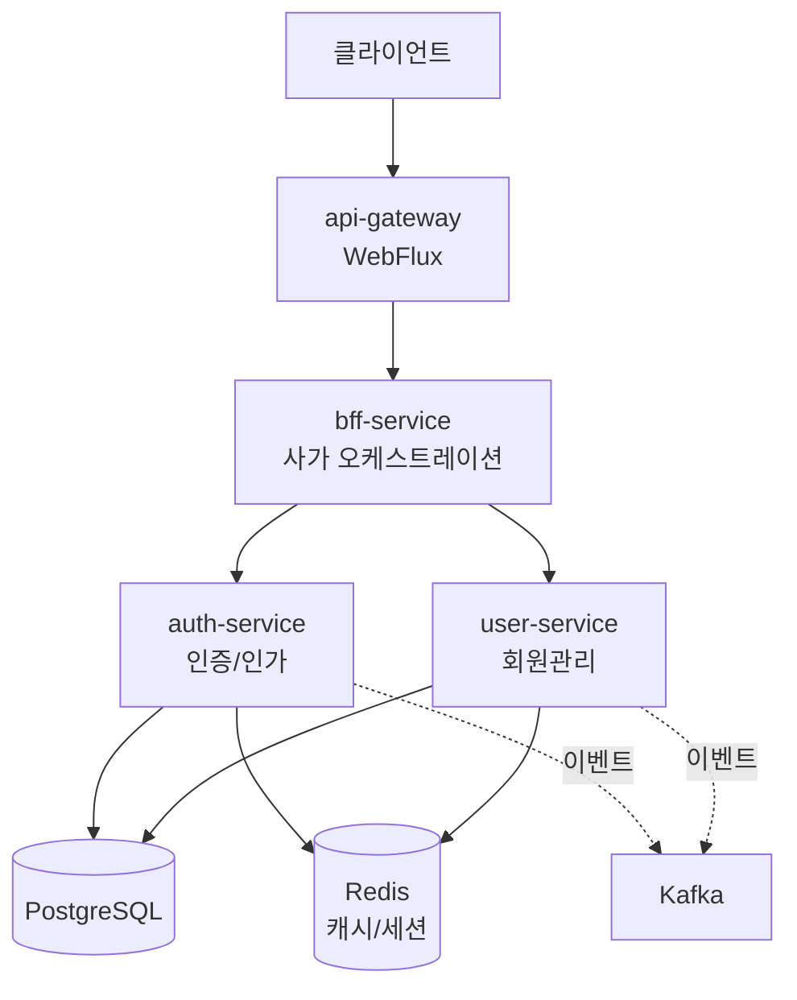

# NextMall


---

## 한눈에 보기

**What**: MSA 학습 프로젝트. Policy 엔진, 사가 패턴, CQRS 적용

**Why**: 경험하지 못한 기술(MSA, Kafka, CQRS)을 학습하고, 실무 문제(정책-코드 강결합)의 대안 탐색

**How**: ADR로 설계 근거 기록 + Testcontainers 통합 테스트 + AI 리뷰(CodeRabbit)

**현재 상태**: Auth/User/Gateway/BFF 구현 완료, Kafka 이벤트 드리븐 설계 중

**핵심 문서**: [ADR 목록](docs/decisions/) | [PBAC 아키텍처](docs/architecture/authorization-pbac.md) | [아키텍처 다이어그램](#아키텍처)

---

## 주요 설계 결정 (ADR)

각 기술 선택에 대한 이유를 문서화했습니다.

| 왜 이렇게 했나요? | 이유                                                  | 문서 |
|----------|-----------------------------------------------------|------|
| **왜 서비스별로 배포 단위를 분리했나요?** | Gateway는 WebFlux(비동기), 나머지는 MVC 기반 서비스를 동시에 사용하기 위해 | [ADR-002](docs/decisions/ADR-002-모듈러-모놀리식에서-마이크로서비스로-전환.md) |
| **왜 JPA와 jOOQ를 함께 쓰나요?** | Command(쓰기)는 JPA로 도메인 중심, Query(읽기)는 jOOQ로 성능 최적화   | [ADR-001](docs/decisions/ADR-001-JOOQ와-JPA-분리-전략.md) |
| **왜 Policy 모듈을 만들었나요?** | 실무에서 겪은 정책-코드 강결합 문제 해결. 정책을 데이터로 관리해 런타임 변경 가능 | [ADR-003](docs/decisions/ADR-003-Policy-모듈-도입.md) |
| **왜 RBAC이 아닌 PBAC인가요?** | 리소스 속성 기반 동적 인가 필요. Policy 모듈 기반으로 일관된 설계 | [ADR-004](docs/decisions/ADR-004-PBAC-선택이유.md) |
| **왜 사가를 BFF에 두었나요?** | 초기 단계에서 사가 플로우와 BFF API는 함께 변경됨. 변경 포인트 최소화         | [ADR-005](docs/decisions/ADR-005-BFF에서-사가-오케스트레이션-통합.md) |
| **모듈 간 의존성은 어떻게 관리하나요?** | 순환 의존성 제거 및 명확한 계층 구조 확립. test-support는 테스트 인프라만 제공 | [ADR-006](docs/decisions/ADR-006-모듈-의존성-원칙.md) |

---

## 프로젝트 목적

실무에서 겪은 문제(정책-코드 강결합)의 대안을 탐색하고,  
경험하지 못한 기술(MSA, Kafka, CQRS, Policy 엔진)을 학습하기 위한 프로젝트입니다.

> **왜 이커머스 도메인인가?**  
> 실무 경험(WMS)과 연결되면서도, 주문/결제 등 미경험 영역을 학습할 수 있고, MSA/CQRS/사가 패턴을 모두 적용하기 적합한 도메인

### 학습 목표

**기술 스택 학습**
- MSA 아키텍처 (Gateway, BFF, 서비스 분리)
- 이벤트 드리븐 (Kafka)
- CQRS (JPA + jOOQ)
- 사가 패턴
- Policy 엔진

**실무 문제 해결 방안 탐색**
- 정책-코드 강결합 → Policy as Data
- 분산 트랜잭션 → 사가 패턴
- 서비스 간 강결합 → 이벤트 드리븐

**설계 결정 문서화**
- ADR로 기술 선택 근거 기록
- 대안 비교 및 트레이드오프 분석

### 개발 방식

1인 개발이지만 실무 프로세스를 적용했습니다:

- **Issue 기반 작업 관리**: 주요 작업은 Issue로 관리하고 결정 과정을 문서화
- **PR 기반 병합**: main 브랜치 직접 커밋 금지, CodeRabbit AI 리뷰 활용
- **코드 품질 관리**: SonarQube로 정적 분석 및 품질 지표 모니터링

---

## 실무에서 겪은 문제와 학습 방향

| 겪었던 문제 | 학습할 패턴 | 시도할 방법 |
|----------|----------|----------|
| 정책-코드 강결합 | Policy as Data | 정책을 데이터로 관리 (1단계: 인가 정책, 2단계: 비즈니스 로직) |
| 복잡한 트랜잭션 처리 | 사가 패턴 | 분산 트랜잭션 + 보상 처리 |
| 서비스 간 강결합 | 이벤트 드리븐 | Kafka 기반 비동기 통신 |
| 조회 성능 이슈 | CQRS (JPA + jOOQ) | Command는 JPA, Query는 jOOQ로 분리 |

---

## 프로젝트 구조

단일 Gradle 프로젝트 내에서 멀티모듈로 구성했습니다.

```
nextmall/
├── services/              # 배포 가능한 독립 서비스
│   ├── api-gateway/      # Spring Cloud Gateway (WebFlux)
│   ├── bff-service/      # Backend for Frontend + 사가 오케스트레이션
│   ├── auth-service/     # 인증/인가 (PBAC)
│   ├── user-service/     # 회원 관리
│   ├── order-service/    # 주문 관리 (설계 중)
│   └── product-service/  # 상품 관리 (설계 중)
│
├── modules/              # 도메인 로직 모듈
│   ├── auth/
│   ├── bff/
│   ├── user/
│   ├── order/            # 설계 중
│   └── product/          # 설계 중
│
├── common/               # 공통 모듈
│   ├── authorization/    # PBAC 인가
│   ├── data/             # JPA + jOOQ + Liquibase
│   ├── security/         # JWT, 내부 토큰
│   ├── kafka/            # Kafka 이벤트
│   ├── redis/            # Redis 캐시/세션
│   ├── policy/           # 정책 엔진
│   ├── exception/        # 공통 예외
│   ├── util/             # 유틸리티
│   ├── identifier/       # ID 생성
│   ├── integration/      # 외부 연동
│   └── test-support/     # 테스트 인프라
│
├── buildSrc/             # Gradle 빌드 로직
├── docker/               # 로컬 개발 환경
└── docs/                 # ADR 및 아키텍처 문서
```

### 모듈 의존성

**프로덕션 코드:**
```
services/* → modules/* → common/*
```

**테스트 코드:**
```
common/* (단위 테스트)
modules/*, services/* → test-support (통합 테스트)
```

**핵심 원칙:**
- 의존성은 단방향으로만 흐름 (순환 의존성 원천 차단)
- common 모듈은 순수 단위 테스트만 수행
- 통합 테스트는 test-support를 통해 modules/services 계층에서 수행
- 자세한 내용은 [ADR-006](docs/decisions/ADR-006-모듈-의존성-원칙.md) 참고

### 빌드 자동화

**buildSrc**에 커스텀 Gradle 플러그인을 구현해 개발 편의성을 높였습니다:

```bash
./gradlew generateJooq  # 임시 Docker 컨테이너 실행 → Liquibase 마이그레이션 → jOOQ 코드 생성 → 컨테이너 종료
```

- Liquibase 마이그레이션과 jOOQ 코드 생성을 하나의 명령으로 자동화
- 로컬 환경 오염 없이 임시 PostgreSQL 컨테이너에서 스키마 생성
- 스키마 변경 시 수동 작업 없이 타입 안전한 jOOQ 코드 자동 생성

---

## 아키텍처



### 서비스 구성

| 서비스 | 역할 | 상태 |
|--------|------|------|
| **api-gateway** | 진입점. 토큰 검증, 라우팅, Rate Limiting | ✅ 구현 완료 |
| **bff-service** | 사용자 토큰 검증, 내부 토큰 발급, 서비스 호출 조합, 사가 오케스트레이션 | ✅ 구현 완료 |
| **auth-service** | 인증/인가 (PBAC). 로그인, 토큰 관리 | ✅ 구현 완료 |
| **user-service** | 회원 관리. 가입, 프로필 | ✅ 구현 완료 |
| **order-service** | 주문 관리 | 🚧 설계 중 |
| **product-service** | 상품 관리 | 🚧 설계 중 |

### 핵심 설계 원칙

| 원칙 | 설명 |
|------|------|
| **Gateway 책임 분리** | 토큰 존재여부만 검증, 상세 인증/인가는 하위 서비스에서 처리 |
| **Internal Token** | 서비스 간 통신 시 내부 토큰 발행하여 신뢰 구축 |
| **PBAC 인가** | 리소스 속성에 따른 동적 권한 평가 |
| **CQRS** | JPA(Command) + jOOQ(Query) 분리로 읽기/쓰기 최적화 |
| **이벤트 드리븐** | 서비스 간 강결합 방지를 위해 Kafka 도입 예정 |

---

## 기술 스택

<details>
<summary>상세 기술 스택 보기</summary>

### Core
- Kotlin 2.2.21, Java 21, Spring Boot 4.0.1, Gradle 8.x

### Data & Infrastructure
- PostgreSQL 17, Redis 7, JPA (Hibernate) 7.0, jOOQ 3.20, Liquibase 5.0.1

### Communication
- Spring Cloud Gateway 2025.1.0, Spring WebClient, Kafka 3.9

### Security
- Spring Security 7.0, nimbus-jose-jwt 10.x, Jackson 3.0

### Test & Quality
- JUnit 5, Kotest 6.0.7, MockK 1.14.6, Testcontainers 2.0.3, SonarQube 7.1.0, Ktlint 14.0.1

</details>

---

## 문서

주요 설계 결정은 ADR(Architecture Decision Record)로 기록했습니다.

- [ADR-001: JOOQ와 JPA 분리 전략](docs/decisions/ADR-001-JOOQ와-JPA-분리-전략.md)
- [ADR-002: 모듈러 모놀리식에서 마이크로서비스로 전환](docs/decisions/ADR-002-모듈러-모놀리식에서-마이크로서비스로-전환.md)
- [ADR-003: Policy 모듈 도입](docs/decisions/ADR-003-Policy-모듈-도입.md)
- [ADR-004: PBAC 기반 인가 방식 선택](docs/decisions/ADR-004-PBAC-선택이유.md)
- [ADR-005: BFF에서 사가 오케스트레이션 통합](docs/decisions/ADR-005-BFF에서-사가-오케스트레이션-통합.md)
- [ADR-006: 모듈 간 의존성 원칙](docs/decisions/ADR-006-모듈-의존성-원칙.md)

**기술 문서:**
- [PBAC 아키텍처](docs/architecture/authorization-pbac.md)
- [Liquibase 마이그레이션 전략](docs/database/liquibase-strategy.md)

**각 ADR에는 다음이 포함됩니다:**
- 실무에서 겪은 문제
- 대안 비교 및 선택 이유
- 트레이드오프

---

## 개발 환경 설정

```bash
# 프로젝트 클론
git clone https://github.com/LiamKim-DaeYong/nextmall.git
cd nextmall

# 환경 변수 설정
cp .env.example .env

# 인프라 실행
docker-compose up -d

# 빌드 및 실행
./gradlew build
./gradlew :services:api-gateway:bootRun
```

---


