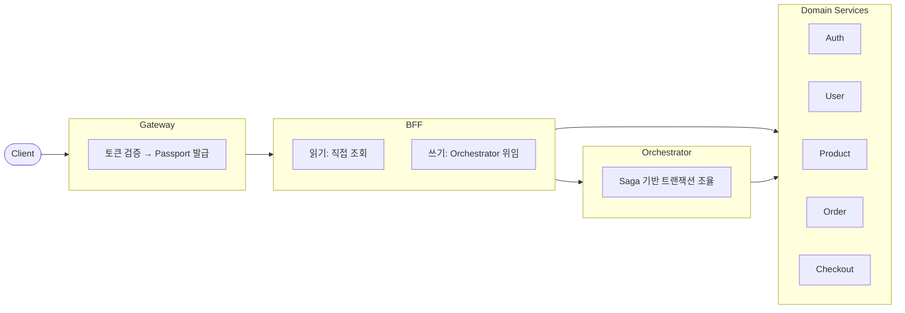

# NextMall


실무에서 직접 다루기 어려운 영역을 경험해보기 위해 만든 이커머스 플랫폼입니다.

---

## 왜 만들었나

- 서비스 분리, 분산 트랜잭션, 이벤트 흐름 같은 주제를 직접 구현해보고 싶었습니다.
- 도메인은 쇼핑몰을 선택했습니다. 결제·주문·재고 흐름을 함께 다루기 좋은 영역이라 판단했습니다.
- 여러 자료를 참고해 선택했고, 다른 접근도 있을 수 있음을 염두에 두었습니다.
- Checkout/Order 흐름은 [UCP(Universal Commerce Protocol)](https://github.com/Universal-Commerce-Protocol/ucp) 설계를 참고했습니다.

---

## 구조



| 레이어 | 역할 |
|--------|------|
| Gateway | 외부 토큰 검증, 내부 Passport 발급 |
| BFF | UI 데이터 집계, 쓰기 요청 위임 |
| Orchestrator | 다중 서비스 워크플로우 조율 (Saga) |
| Domain Services | 단일 도메인 책임, JPA/jOOQ 기반 |

---

## 시도한 것들

### 서비스 분리

BFF와 Orchestrator를 별도 서비스로 분리했습니다.
호출 홉이 늘어나고 운영 부담이 증가하는 트레이드오프를 직접 체감해보려는 목적이었습니다.

### 트랜잭션 조율

핵심 워크플로우(회원가입, 주문 생성)는 Orchestrator에서 명시적으로 조율합니다.
부가 처리(알림, 로깅 등)는 Kafka 이벤트로 분리할 예정입니다.

### CQRS

읽기는 jOOQ, 쓰기는 JPA로 분리했습니다.
같은 DB를 사용하므로 완전한 CQRS는 아니지만, 쿼리 최적화와 도메인 모델 분리의 이점을 경험해보려 했습니다.

### Edge Authentication

Gateway에서 외부 토큰(JWT)을 검증하고, 내부용 Passport로 변환합니다.
내부 서비스는 Passport만 신뢰하면 되므로 인증 로직이 단순해집니다.

### 모니터링

OpenTelemetry Collector를 중심으로 Traces, Metrics, Logs를 통합 수집합니다.
Grafana + Prometheus + Loki + Tempo 스택으로 구성했습니다.

[//]: # (![Grafana Dashboard]&#40;docs/images/grafana-dashboard.png&#41;)
[//]: # (<!-- TODO: 대시보드 스크린샷 추가 -->)

### 빌드 자동화

jOOQ 코드 생성을 위한 Gradle Plugin을 직접 구현했습니다.
Docker로 임시 PostgreSQL 컨테이너를 띄우고, Liquibase로 마이그레이션을 적용한 뒤, jOOQ 코드를 생성하고 컨테이너를 정리하는 파이프라인입니다.

### Policy Engine

PBAC(Policy-Based Access Control) 방식의 권한 제어를 위해 DSL 기반 Policy Engine을 구현 중입니다.
초기 단계이며, 조건 평가와 규칙 조합까지 구현되어 있습니다.

### ID 생성

분산 환경에서의 ID 충돌을 방지하기 위해 Snowflake ID Generator를 직접 구현했습니다.
Edge case와 Validation 테스트를 포함하고 있습니다.

---

## 기술 스택

| 영역 | 기술 |
|------|------|
| Language | Kotlin |
| Framework | Spring Boot 4, Spring Cloud 2025 |
| Data | PostgreSQL, Redis, JPA, jOOQ |
| Messaging | Kafka (구성 완료, 이벤트 연동 진행 중) |
| Observability | OpenTelemetry, Grafana, Prometheus, Loki, Tempo |
| Test | Kotest, Testcontainers |

---

## 모듈 구조

```
nextmall/
├── services/                 # 도메인 서비스
│   ├── api-gateway          # 인증, 라우팅
│   ├── bff-service          # UI 집계
│   ├── orchestrator-service # Saga 조율
│   ├── auth-service         # 인증/토큰
│   ├── user-service         # 회원
│   ├── product-service      # 상품
│   ├── order-service        # 주문
│   └── checkout-service     # 주문 전 세션
│
├── common/                   # 공유 모듈
│   ├── security-core        # JWT, 인증 기반
│   ├── security             # Spring Security 통합
│   ├── authorization        # 권한 검증
│   ├── policy               # Policy Engine (DSL)
│   ├── data                 # JPA/jOOQ 공통
│   ├── redis                # 캐시, 분산 락
│   ├── kafka                # 이벤트 발행/구독
│   ├── integration          # 서비스 간 통신
│   ├── exception            # 예외 처리
│   ├── identifier           # ID 생성 (Snowflake)
│   ├── util                 # 유틸리티
│   └── test-support         # 테스트 헬퍼
│
└── buildSrc/                 # Gradle 플러그인
    └── JooqCodegenPlugin    # jOOQ 코드 생성 자동화
```

---

## 실무 경험

이 프로젝트를 시작하게 된 배경이 된 실무 경험입니다.

| 프로젝트 | 해결한 문제 | 상세 |
|----------|-------------|------|
| 물류 시스템 | 순환 비즈니스 로직 → Event Loop 오케스트레이션 | [문서](docs/experience/logistics-orchestration.md) |

---

## 빠른 시작

```bash
git clone https://github.com/LiamKim-DaeYong/nextmall.git
cd nextmall

# 환경 설정
cp .env.example .env
cp nextmall-codegen.properties.example nextmall-codegen.properties

# 인프라 실행 및 빌드
docker compose up -d
./gradlew build
```

---

## 아직 부족한 부분

- 테스트 커버리지 보강 필요
- Kafka 도메인 이벤트 연동 진행 중
- Circuit Breaker 미구현
- API 문서화 (OpenAPI) 검토 중

---

## 문서

상세 내용은 [docs/](docs/README.md)에 정리했습니다.
