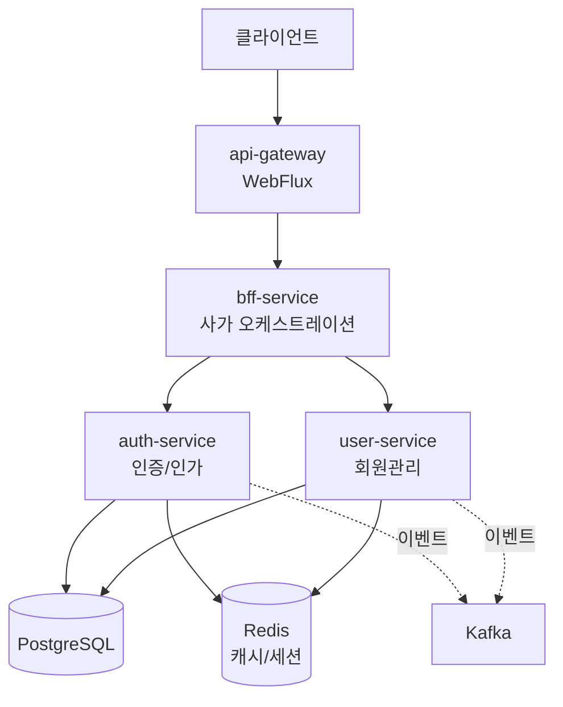

# NextMall


---

## 한눈에 보기

**What**: 실무에서 겪은 문제(정책-코드 강결합, 분산 트랜잭션)를 PBAC, 사가 패턴, CQRS로 해결하는 MSA 프로젝트

**Why**: 설계 대안을 직접 구현하고 검증하기 위해. 단순 학습이 아닌 "실무 적용 가능성" 검증

**How**: ADR로 설계 근거 기록 + Testcontainers로 통합 테스트 환경 구축 + AI 리뷰(CodeRabbit)로 품질 관리

**현재 상태**: 인증(Auth) + 회원(User) + Gateway/BFF 기반 흐름 구현 완료, Kafka 기반 이벤트 드리븐 통신은 설계 및 단계적 도입 중

**핵심 문서**: [ADR 목록](docs/decisions/) | [PBAC 아키텍처](docs/architecture/authorization-pbac.md) | [아키텍처 다이어그램](#아키텍처)

---

## 주요 설계 결정 (ADR)

각 기술 선택에 대한 이유를 문서화했습니다.

| 왜 이렇게 했나요? | 이유                                                  | 문서 |
|----------|-----------------------------------------------------|------|
| **왜 서비스별로 배포 단위를 분리했나요?** | Gateway는 WebFlux(비동기), 나머지는 MVC 기반 서비스를 동시에 사용하기 위해 | [ADR-002](docs/decisions/ADR-002-모듈러-모놀리식에서-마이크로서비스로-전환.md) |
| **왜 JPA와 jOOQ를 함께 쓰나요?** | Command(쓰기)는 JPA로 도메인 중심, Query(읽기)는 jOOQ로 성능 최적화   | [ADR-001](docs/decisions/ADR-001-JOOQ와-JPA-분리-전략.md) |
| **왜 사가를 BFF에 두었나요?** | 초기 단계에서 사가 플로우와 BFF API는 함께 변경됨. 변경 포인트 최소화         | [ADR-003](docs/decisions/ADR-003-BFF에서-사가-오케스트레이션-통합.md) |
| **왜 RBAC이 아닌 PBAC인가요?** | 실무에서 겪은 "정책-코드 강결합" 문제 해결. 런타임 정책 변경 가능             | [ADR-004](docs/decisions/ADR-004-pbac-선택이유.md) |

---

## 프로젝트 배경

실무에서 MSA를 운영하며 겪은 문제를 다른 방식으로 해결해보고 싶었습니다.  
동시에 실무에서 경험하지 못한 기술 스택(Redis, Kafka, CQRS)도 함께 학습하고 싶었습니다.

```kotlin
// 예시: 정책이 코드에 강결합되어 변경 시마다 배포 필요
if (warehouse.type == "TECHNICIAN" && outboundDelivery.type == "INSTALLED") {
    outboundDelivery.status = "COMPLETED"
}
```

> **왜 이커머스 도메인인가?**  
> 실무 경험(WMS)과 연결되면서도, 주문/결제 등 미경험 영역을 학습할 수 있고, MSA/CQRS/사가 패턴을 모두 적용하기 적합한 도메인

---

## 실무에서 겪은 문제와 학습 방향

| 겪었던 문제 | 학습할 패턴 | 시도할 방법 |
|----------|----------|----------|
| 정책-코드 강결합 | PBAC | 정책을 데이터로 관리, 런타임 변경 |
| 복잡한 트랜잭션 처리 | 사가 패턴 | 분산 트랜잭션 + 보상 처리 |
| 서비스 간 강결합 | 이벤트 드리븐 | Kafka 기반 비동기 통신 |
| 조회 성능 이슈 | CQRS (JPA + jOOQ) | Command는 JPA, Query는 jOOQ로 분리 |

---

## 프로젝트 구조

단일 Gradle 프로젝트 내에서 멀티모듈로 구성했습니다.

```
nextmall/
├── services/              # 배포 가능한 독립 서비스
│   ├── api-gateway/      # Spring Cloud Gateway (WebFlux)
│   ├── bff-service/      # Backend for Frontend + 사가 오케스트레이션
│   ├── auth-service/     # 인증/인가 서비스
│   └── user-service/     # 회원 관리 서비스
│
├── modules/              # 도메인 로직 모듈 (서비스에서 참조)
│   ├── auth/             # 인증 도메인
│   ├── bff/              # BFF 도메인
│   └── user/             # 사용자 도메인
│
├── common/               # 공통 모듈
│   ├── authorization/    # PBAC 인가 처리
│   ├── data/             # JPA + jOOQ 구성 + Liquibase DB 마이그레이션
│   ├── security/         # JWT, 내부 토큰
│   ├── kafka/            # Kafka 이벤트 처리
│   ├── redis/            # Redis 캐시/세션
│   ├── policy/           # 정책 엔진
│   └── test-support/     # 테스트 유틸리티
│
├── buildSrc/             # Gradle 빌드 로직 공통화
├── docker/               # 로컬 개발 환경 (PostgreSQL, Redis, Kafka)
└── docs/                 # ADR 및 아키텍처 문서
```

### 모듈 의존성

- **services** → **modules** → **common**
- 각 서비스는 필요한 도메인 모듈과 공통 모듈만 의존
- 도메인 모듈 간 직접 의존 금지 (이벤트로 통신)

### 빌드 자동화

**buildSrc**에 커스텀 Gradle 플러그인을 구현해 개발 편의성을 높였습니다:

```bash
./gradlew generateJooq  # 임시 Docker 컨테이너 실행 → Liquibase 마이그레이션 → jOOQ 코드 생성 → 컨테이너 종료
```

- Liquibase 마이그레이션과 jOOQ 코드 생성을 하나의 명령으로 자동화
- 로컬 환경 오염 없이 임시 PostgreSQL 컨테이너에서 스키마 생성
- 스키마 변경 시 수동 작업 없이 타입 안전한 jOOQ 코드 자동 생성

---

## 아키텍처



### 서비스 구성

| 서비스 | 역할 |
|--------|------|
| **api-gateway** | 진입점. 토큰 검증, 라우팅, Rate Limiting |
| **bff-service** | 사용자 토큰 검증, 내부 토큰 발급, 서비스 호출 조합 |
| **auth-service** | 인증/인가. 로그인, 토큰 관리 |
| **user-service** | 회원 관리. 가입, 프로필 |

### 핵심 설계 원칙

| 원칙 | 설명 |
|------|------|
| **Gateway 책임 분리** | 토큰 존재여부만 검증, 상세 인증/인가는 하위 서비스에서 처리 |
| **Internal Token** | 서비스 간 통신 시 내부 토큰 발행하여 신뢰 구축 |
| **PBAC 인가** | 리소스 속성에 따른 동적 권한 평가 |
| **CQRS** | JPA(Command) + jOOQ(Query) 분리로 읽기/쓰기 최적화 |
| **이벤트 드리븐** | 서비스 간 강결합 방지를 위해 Kafka 도입 예정 |

---

## 기술 스택

<details>
<summary>상세 기술 스택 보기</summary>

### Core
- Kotlin 2.2.21, Java 21, Spring Boot 4.0.1, Gradle 8.x

### Data & Infrastructure
- PostgreSQL 17, Redis 7, JPA (Hibernate) 7.0, jOOQ 3.20, Liquibase 5.0.1

### Communication
- Spring Cloud Gateway 2025.1.0, Spring WebClient, Kafka 3.9

### Security
- Spring Security 7.0, nimbus-jose-jwt 10.x, Jackson 3.0

### Test & Quality
- JUnit 5, Kotest 6.0.7, MockK 1.14.6, Testcontainers 2.0.3, SonarQube 7.1.0, Ktlint 14.0.1

</details>

---

## 문서

주요 설계 결정은 ADR(Architecture Decision Record)로 기록했습니다.

- [ADR-001: JOOQ와 JPA 분리 전략](docs/decisions/ADR-001-JOOQ와-JPA-분리-전략.md)
- [ADR-002: 모듈러 모놀리식에서 마이크로서비스로 전환](docs/decisions/ADR-002-모듈러-모놀리식에서-마이크로서비스로-전환.md)
- [ADR-003: BFF에서 사가 오케스트레이션 통합](docs/decisions/ADR-003-BFF에서-사가-오케스트레이션-통합.md)
- [ADR-004: PBAC 기반 인가 방식 선택](docs/decisions/ADR-004-pbac-선택이유.md)

**기술 문서:**
- [PBAC 아키텍처](docs/architecture/authorization-pbac.md)
- [Liquibase 마이그레이션 전략](docs/database/liquibase-strategy.md)

**각 ADR에는 다음이 포함됩니다:**
- 실무에서 겪은 문제
- 대안 비교
- 선택 이유
- 트레이드오프
- 향후 고려사항

---

## 개발 환경 설정

```bash
# 프로젝트 클론
git clone https://github.com/LiamKim-DaeYong/nextmall.git
cd nextmall

# 환경 변수 설정
cp .env.example .env

# 인프라 실행
docker-compose up -d

# 빌드 및 실행
./gradlew build
./gradlew :services:api-gateway:bootRun
```

---

## 프로젝트 목적

완성된 서비스가 아니라, **설계 선택의 이유를 고민하고 기록하는 연습**입니다.

- 실무에서 경험하지 못한 기술과 아키텍처를 직접 적용해보기
- 단순 CRUD가 아닌, 경계 / 통신 / 실패 / 보안을 고려한 구조 연습
- GitHub Issue + PR + 리뷰 기반의 실무형 개발 프로세스 시뮬레이션
- AI(CodeRabbit)와 협업: PR 리뷰 자동화, 설계 대안 비교는 LLM과 ADR로 정리

### 일하는 방식도 함께 고민

1인 개발이지만 실무 프로세스를 최대한 재현했습니다:

- **Issue & 문서화**: 주요 작업은 Issue로 관리하고 결정 과정을 문서화
- **PR 필수 정책**: main 브랜치 직접 커밋 금지, 모든 변경은 PR을 통해서만 병합
- **AI 코드 리뷰**: CodeRabbit이 모든 PR을 리뷰하고 approve
- **코드 품질 관리**: SonarQube로 정적 분석 및 코드 품질 지표 모니터링
- **멀티 LLM 활용**: Claude, GPT, Gemini, Amazon Q를 활용해 설계 결정 검증 및 ADR 작성
