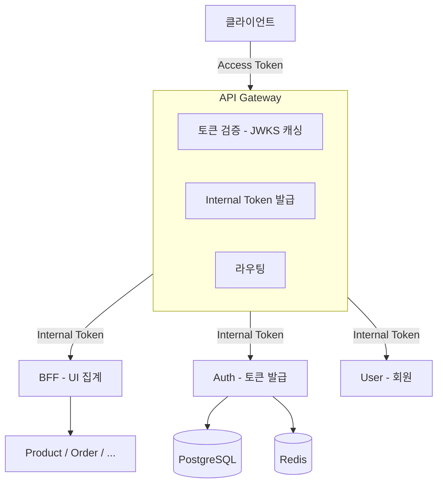

# NextMall


---

## 한눈에 보기

| | |
|---|---|
| **What** | 분산 시스템 설계를 학습하기 위한 이커머스 플랫폼 |
| **Why** | 실무 환경의 제약(메시지 큐 없음, 수동 장애 복구)을 넘어 직접 설계해보기 위해 |
| **How** | Edge Authentication, CQRS, Saga 패턴, 분산 락, 이벤트 드리븐 |

---

## 왜 이 프로젝트를 만들었나요?

### 실무 경험

물류 시스템을 킥오프부터 운영까지 담당하며 **정합성 중심 아키텍처**를 설계했습니다.

**해결한 문제:**
- 도메인 간 **순환 비즈니스 로직** (A 처리 → B 이벤트 발생 → B 처리 → 다시 A 이벤트 발생)
- 초기 Facade 패턴 시도 → 실패 → **Event Loop 기반 오케스트레이션**으로 재설계
- Hook 시스템으로 검증/로깅 분리, ThreadLocal 기반 요청 추적, 테스트 DSL 설계

**환경 제약:**
- RDB만 사용, 비관적 락 + 단일 트랜잭션으로 정합성 보장
- WebClient 기반 동기 호출만 사용 (메시지 큐, 서킷 브레이커 없음)
- 서비스 간 호출 실패 시 **개발자가 수동으로 API 재호출 또는 DB 직접 수정**
- 장애 추적: 서비스별 로그만 존재, 전체 요청 흐름 추적 어려움

> 상세 내용: [실무 경험 - 물류 오케스트레이션 시스템](docs/experience/logistics-orchestration.md)

### 학습 목표

실무에서 정합성 중심 설계 경험은 있지만, **분산 환경**에서의 문제 해결은 직접 경험해보지 못했습니다.

이 프로젝트에서 달성하고자 하는 것:
- 서비스 간 호출 실패 시 **자동 복구** (Kafka + DLQ)
- 분산 환경에서의 **동시성 제어** (Redis 분산 락)
- 여러 서비스를 거치는 요청의 **전체 흐름 추적** (OpenTelemetry)

---

## 해결하려는 문제들

실무 환경의 제약으로 경험하지 못한 영역들을 직접 설계하고 구현합니다.

| 문제 | 실무에서의 접근 | NextMall에서의 접근 | 문서 |
|------|---------------|-------------------|------|
| **동시 요청 시 정합성** | 비관적 락 + 단일 트랜잭션 | 분산 락 + 낙관적 락 조합 | 작성 예정 |
| **서비스 간 인증** | 내부 라이브러리 (직접 구축 X) | Edge Authentication + Internal Token | [ADR-007](docs/decisions/ADR-007-Edge-Authentication.md) |
| **복잡한 비즈니스 흐름** | Event Loop + BFS 방식 | Saga 패턴 + 보상 트랜잭션 | [ADR-005](docs/decisions/ADR-005-BFF에서-사가-오케스트레이션-통합.md) |
| **조회 성능** | QueryDSL | CQRS (JPA + jOOQ) | [ADR-001](docs/decisions/ADR-001-JOOQ와-JPA-분리-전략.md) |
| **정책 변경 시 배포** | 코드에 하드코딩 | Policy as Data | [ADR-003](docs/decisions/ADR-003-Policy-모듈-도입.md) |
| **서비스 간 강결합** | 동기 호출 | Kafka 이벤트 드리븐 | 작성 예정 |
| **장애 추적** | ThreadLocal 로그 수집 | OpenTelemetry + Grafana LGTM | 구현 예정 |

---

## 아키텍처

Netflix Edge Authentication 패턴을 적용했습니다.



### 왜 이 구조인가요?

**Edge Authentication (Gateway 토큰 검증)**

Netflix에서 검증된 패턴입니다. Gateway에서 모든 외부 토큰을 처리하고, 내부에는 신뢰된 토큰(Passport)만 전파합니다.

> "우리는 복잡한 사용자/기기 인증 처리를 네트워크 Edge로 이동시켰다. **95%의 요청은 원격 호출 없이 처리된다.**"
> — [Netflix Tech Blog](https://netflixtechblog.com/edge-authentication-and-token-agnostic-identity-propagation-514e47e0b602)

| 결정 | 이유 | 참고 |
|------|------|------|
| Gateway에서 토큰 검증 | JWKS 캐싱으로 로컬 검증, 네트워크 I/O 없음 | [Netflix Edge Auth](https://netflixtechblog.com/edge-authentication-and-token-agnostic-identity-propagation-514e47e0b602) |
| Internal Token 발급 | 하위 서비스는 인증 로직 제거, 비즈니스에만 집중 | [Netflix Passport](https://www.infoq.com/presentations/netflix-user-identity/) |
| BFF는 UI 집계만 | 인증/발급은 Gateway, 복잡한 트랜잭션은 Orchestrator | [Sam Newman BFF](https://samnewman.io/patterns/architectural/bff/) |

**아키텍처 발전 과정**

이 구조는 처음부터 이렇지 않았습니다. 모듈러 모놀리식 → MSA → Edge Authentication으로 발전해왔습니다.
자세한 과정은 [아키텍처 발전 과정](docs/architecture/evolution.md)을 참고하세요.

---

## 주요 기술 결정 (ADR)

각 기술 선택에는 이유가 있습니다.

| 결정 | 한 줄 요약 | 문서 |
|------|----------|------|
| **CQRS (JPA + jOOQ)** | Command는 도메인 중심, Query는 성능 최적화. N+1 문제 근본 해결 | [ADR-001](docs/decisions/ADR-001-JOOQ와-JPA-분리-전략.md) |
| **Policy as Data** | 정책 변경 시 코드 수정 없이 런타임 변경 가능 | [ADR-003](docs/decisions/ADR-003-Policy-모듈-도입.md) |
| **PBAC 인가** | RBAC의 한계 극복, 리소스 속성 기반 동적 인가 | [ADR-004](docs/decisions/ADR-004-PBAC-선택이유.md) |
| **BFF + Saga** | 초기 단계에서 변경 포인트 최소화, 안정화 후 분리 검토 | [ADR-005](docs/decisions/ADR-005-BFF에서-사가-오케스트레이션-통합.md) |
| **Edge Authentication** | Netflix 검증된 패턴, Gateway에서 토큰 처리 | [ADR-007](docs/decisions/ADR-007-Edge-Authentication.md) |

### 추가 예정 ADR

| 주제 | 다루는 내용 |
|------|-----------|
| 동시성 제어 전략 | 비관적 락 vs 낙관적 락 vs 분산 락, 언제 뭘 쓰는가 |
| 캐시 전략 | Cache Aside, Write Through, 캐시 무효화 |
| 이벤트 드리븐 | Kafka 기반 비동기 통신, 최종 일관성 |

### 학습 기록

프로젝트를 진행하며 배운 내용을 [학습 노트](docs/til/)에 정리하고 있습니다.

---

## 프로젝트 구조

```
nextmall/
├── services/                    # 배포 단위 (Self-Contained)
│   ├── api-gateway/            # WebFlux, 토큰 검증, 라우팅
│   ├── bff-service/            # MVC, UI 집계, Saga
│   ├── auth-service/           # 인증/인가, 토큰 발급
│   ├── user-service/           # 회원 관리
│   ├── product-service/        # 상품 관리
│   └── order-service/          # 주문 관리
│
├── common/                      # 인프라 공통 (비즈니스 로직 X)
│   ├── security/               # JWT, Spring Security
│   ├── data/                   # JPA + jOOQ
│   ├── exception/              # 예외 체계
│   ├── redis/                  # Redis 공통
│   ├── kafka/                  # Kafka 공통
│   └── ...
│
├── e2e-test/                   # E2E 테스트 (Karate)
└── docs/                       # ADR, 아키텍처 문서
```

> **common/ 정책**: 비즈니스 로직은 공유하지 않습니다. JWT 검증, DB 연결, 예외 처리 등 **인프라 코드만** 포함하며, 도메인 간 결합을 만들지 않습니다.

---

## 기술 스택

| 영역 | 기술 | 선택 이유 |
|------|------|----------|
| **Framework** | Spring Boot 4.0.1 | 최신 버전, Kotlin 지원 |
| **Language** | Kotlin 2.2.21 | Null Safety, DSL 지원 |
| **Gateway** | Spring Cloud Gateway | WebFlux 기반, 비동기 |
| **Command** | JPA (Hibernate 7) | 도메인 모델 중심 |
| **Query** | jOOQ 3.20 | 타입 안전한 SQL, N+1 해결 |
| **Database** | PostgreSQL 17 | 트랜잭션, JSONB 지원 |
| **Cache** | Redis 7 | 세션, 캐시, 분산 락 |
| **Message** | Kafka 3.9 `planned` | 이벤트 드리븐 → [진행 상황](#현재-진행-상황) |
| **Observability** | OpenTelemetry + Grafana `planned` | 분산 추적 → [진행 상황](#현재-진행-상황) |
| **Test** | Kotest, Testcontainers | Kotlin DSL로 테스트 가독성 향상, 실제 DB/Redis 컨테이너 테스트 |

---

## 현재 진행 상황

| 영역 | 상태 |
|------|------|
| Auth/User/Gateway/BFF 기본 흐름 | ✅ 완료 |
| Edge Authentication (Gateway 토큰 검증) | ✅ 완료 |
| CQRS (JPA + jOOQ) | ✅ 적용 |
| PBAC 인가 | ✅ 기본 구현 |
| Kafka 이벤트 드리븐 | 🚧 설계 중 |
| OpenTelemetry 관측성 | 🚧 설계 중 |
| E2E 테스트 환경 | 📋 계획 |

---

## 개발 방식

1인 개발이지만 실무 프로세스를 적용하고 있습니다:

- **ADR 기반 의사결정**: 기술 선택의 이유와 트레이드오프를 문서로 기록
- **PR 기반 병합**: main 브랜치 직접 커밋 금지
- **AI 코드 리뷰**: [CodeRabbit](https://coderabbit.ai/)으로 PR 자동 리뷰
- **빅테크 사례 조사**: Netflix, Uber 등 검증된 패턴 참고 후 적용

**문서화:**
- [아키텍처 결정 기록 (ADR)](docs/decisions/) - 주요 기술 결정과 근거
- [아키텍처 발전 과정](docs/architecture/evolution.md) - 구조 변화 히스토리
- [학습 노트 (TIL)](docs/til/) - 프로젝트 진행하며 배운 내용

---

## 참고 자료

### 아키텍처
- [Netflix - Edge Authentication](https://netflixtechblog.com/edge-authentication-and-token-agnostic-identity-propagation-514e47e0b602)
- [Sam Newman - BFF Pattern](https://samnewman.io/patterns/architectural/bff/)
- [AWS - Saga Orchestration](https://docs.aws.amazon.com/prescriptive-guidance/latest/cloud-design-patterns/saga-orchestration.html)

### 모듈 구조
- [Don't Share Libraries among Microservices](https://phauer.com/2016/dont-share-libraries-among-microservices/)
- [Self-Contained Systems](https://scs-architecture.org/vs-ms.html)

---

## 개발 환경 설정

### 빠른 시작

```bash
# 클론
git clone https://github.com/LiamKim-DaeYong/nextmall.git
cd nextmall

# 환경 변수
cp .env.example .env

# 인프라 실행 (Docker Compose v2)
docker compose up -d

# 빌드
./gradlew build
```

### 서비스 실행

```bash
# 전체 실행 (권장 순서)
./gradlew :services:api-gateway:bootRun     # 8080
./gradlew :services:auth-service:bootRun    # 8081
./gradlew :services:bff-service:bootRun     # 8082
./gradlew :services:user-service:bootRun    # 8083

# 최소 실행 (Gateway + Auth만)
./gradlew :services:api-gateway:bootRun
./gradlew :services:auth-service:bootRun
```
