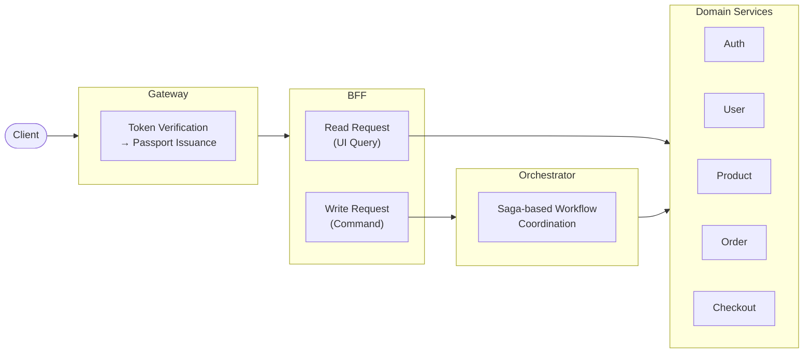
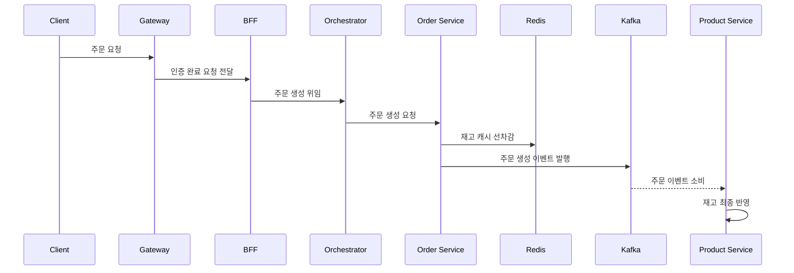

# NextMall

서비스 분리와 트랜잭션 조율, 이벤트 기반 흐름에서 발생하는 아키텍처적 트레이드오프를 설계하고 검증하기 위해 만든 이커머스 플랫폼입니다.

---

## 왜 만들었나

서비스 분리, 트랜잭션 조율, 이벤트 기반 흐름은 구현 자체보다 선택의 결과를 끝까지 경험하기 어려운 영역이며, 조직의 구조와 의사결정에 따라 개인이 체감할 수 있는 경험 편차가 크게 발생한다고 생각했습니다.

이 프로젝트는 그러한 간극을 메우기 위해 아키텍처 선택과 그 결과를 끝까지 따라가며 검증해보기 위한 시도입니다. 단순히 구조를 나누는 것이 아니라, 선택에 따른 복잡도 증가와 운영 부담까지 함께 고려하는 것을 목표로 했습니다.

결제·주문·재고처럼 상태 변화가 복합적으로 얽히는 도메인이 필요했고, 이를 자연스럽게 포함하는 사례로 이커머스를 선택했습니다. 이 과정에서 도메인 자체를 임의로 정의하기보다는, 검증된 사고 틀을 참고해 전체 흐름을 빠르게 정리하고 아키텍처 설계에 집중하고자 했습니다.

> 🔎 [UCP를 참고한 이유](https://github.com/Universal-Commerce-Protocol/ucp)
>
> Universal Commerce Protocol(UCP)는 커머스 도메인 전반에서 주문과 결제 흐름을 역할과 책임 관점으로 정리하기 위해 제안된 오픈소스 프로토콜입니다.
>
> 본 프로젝트에서는 주문 도메인을 새로 정의하기보다, 이러한 구조적 사고 틀을 참고해 전체 흐름을 빠르게 정리하고자 했습니다.

## 시스템 구성

### 단일 Gradle 프로젝트, 배포 단위는 개별 인스턴스

개발 편의성을 위해 단일 Gradle 멀티모듈 구조를 사용하지만, 각 모듈은 독립 서비스로 실행되는 환경을 전제로 구성했습니다.

모든 서비스는 개별 `main` 진입점을 가지며 독립적으로 기동되고, 배포·확장·장애 전파는 서비스 단위로 분리됩니다.

### Orchestrator Service를 통한 워크플로우 조율

주문과 같이 여러 서비스가 연쇄적으로 호출되는 흐름은 각 서비스 내부에서 암묵적으로 처리하지 않고, Orchestrator Service가 하나의 진입점에서 명시적으로 조율합니다.

다중 서비스에 걸친 처리 흐름은 Saga 형태로 드러나며, 워크플로우 전체를 추적 가능한 구조로 유지합니다.

### 서비스 간 통신은 HTTP 클라이언트 기반으로만 구성

서비스 간 호출은 컴파일 의존성을 두지 않고 WebClient/RestClient 기반 HTTP 통신으로만 이루어집니다.

모듈 간 직접 호출을 허용하는 대신, 실제 운영 환경에서 발생하는 호출 비용과 실패 가능성이 설계 단계에서부터 드러나도록 구성했습니다.

---

## 전체 요청 흐름 개요

클라이언트 요청은 Gateway에서 인증을 거친 뒤, BFF를 통해 UI 요청에 맞게 집계되거나 Orchestrator로 위임되어 다중 서비스 워크플로우를 실행합니다.

> 읽기 요청은 각 Domain Service의 조회 API를 직접 호출하며, 쓰기 요청만 Orchestrator를 통해 조율됩니다.

```mermaid
flowchart LR
    Client([Client])
    Client --> Gateway

    subgraph Gateway["Gateway"]
        G1["Token Verification\n→ Passport Issuance"]
    end

    Gateway --> BFF

    subgraph BFF["BFF"]
        direction TB
        B1["Read Request\n(UI Query)"]
        B2["Write Request\n(Command)"]
    end

%% Read flow
    B1 --> Services

%% Write flow
    B2 --> Orchestrator

    subgraph Orchestrator["Orchestrator"]
        O1["Saga-based Workflow\nCoordination"]
    end

    Orchestrator --> Services

    subgraph Services["Domain Services"]
        direction LR
        Auth["Auth"]
        User["User"]
        Product["Product"]
        Order["Order"]
        Checkout["Checkout"]
    end
```

---

## 주문 생성 흐름 예시

아래는 주문 생성 시 여러 서비스가 연쇄적으로 호출되는 대표적인 실행 흐름입니다.  
재고 선차감과 이벤트 기반 최종 반영을 포함해, 쓰기 요청이 Orchestrator를 통해 어떻게 조율되는지를 보여줍니다.

```mermaid
sequenceDiagram
    participant C as Client
    participant G as Gateway
    participant B as BFF
    participant O as Orchestrator
    participant OD as Order Service
    participant R as Redis
    participant K as Kafka
    participant P as Product Service

    C->>G: 주문 요청
    G->>B: 인증 완료 요청 전달
    B->>O: 주문 생성 위임
    O->>OD: 주문 생성 요청
    OD->>R: 재고 캐시 선차감
    OD->>K: 주문 생성 이벤트 발행
    K-->>P: 주문 이벤트 소비
    P->>P: 재고 최종 반영
```

## 설계 선택과 트레이드오프

아래는 주문 생성 흐름을 구현하면서 의도적으로 선택한 설계 결정과, 그에 따라 감수한 트레이드오프를 정리한 내용입니다.

### 단일 DB를 선택한 이유

현재는 단일 PostgreSQL 인스턴스를 사용하며, 서비스별로 테이블 소유권을 논리적으로 분리해 관리합니다.

DB를 서비스 단위로 분리하는 대신, 트랜잭션 조율과 이벤트 흐름 설계 자체에 집중하기 위한 선택이었으며, 운영 복잡도를 과도하게 늘리지 않는 선에서 아키텍처 구조와 책임 분리를 검증하는 것을 목표로 했습니다.

### 재고를 캐시에서 선차감한 이유

주문 생성 시점에 재고를 즉시 차감하지 않으면 동시 요청 상황에서 재고 정합성이 쉽게 깨질 수 있다고 판단했습니다.

이를 완화하기 위해 Redis를 활용해 재고를 선차감하고, 빠른 실패와 중복 주문 방지를 우선하도록 구성했습니다.
다만 캐시 기반 차감은 최종 정합성을 보장하지 않기 때문에, 이후 이벤트 기반 처리로 보완합니다.

### 이벤트 기반 최종 반영을 선택한 이유

재고의 최종 반영은 Kafka 이벤트를 통해 Product Service가 비동기적으로 처리합니다.

이를 통해 주문 생성 경로에서의 결합도를 낮추고, 재고 처리 지연이나 실패가 주문 생성 전체를 직접적으로 차단하지 않도록 구성했습니다.
대신 이벤트 처리 지연이나 중복 소비에 대한 고려가 필요하며, 이를 감수하는 구조임을 전제로 설계했습니다.

### 쓰기 요청을 Orchestrator로 제한한 이유

조회 요청과 달리, 주문 생성과 같은 쓰기 요청은 여러 서비스에 걸친 상태 변화를 동반합니다.

쓰기 요청을 Orchestrator를 통해서만 처리하도록 제한함으로써, 워크플로우의 진입점을 하나로 고정하고 조율 책임이 분산되지 않도록 했습니다.
그 결과 호출 경로는 길어졌지만, 전체 흐름을 추적하고 제어하기 쉬운 구조를 선택했습니다.
