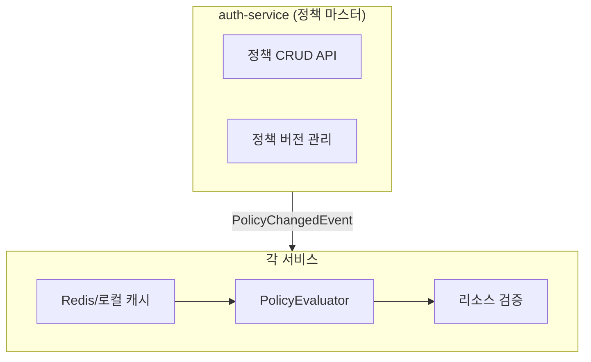

# PBAC 기반 인가 구조 (Policy-Based Access Control)

## 개요

NextMall은 PBAC(Policy-Based Access Control) 방식으로 인가를 처리합니다.
각 서비스가 자신의 리소스에 대한 정책을 정의하고, auth-service가 정책 마스터 데이터를 관리합니다.

## 아키텍처



## 모듈 구조

### common:policy (순수 정책 엔진)
- Spring 의존성 없음
- 정책 모델 정의 (Policy, Rule, Condition)
- PolicyEvaluator (정책 평가 로직)
- PolicyDslBuilder (정책 DSL)

### common:authorization (Spring 통합)
- AOP 기반 인가 체크 (`@RequiresPolicy`)
- AuthorizationService (정책 평가 + 예외 처리)
- PolicyProvider 인터페이스
- AuthorizationContext (인가 컨텍스트)

### 각 서비스 (정책 정의)
- PolicyProvider 구현체
- 로컬 정책 정의 (DSL 사용)
- 리소스 속성 제공 (ResourceAttributeResolver)

## 정책 평가 흐름

### 1. 요청 시작
```kotlin
@RequiresPolicy(resource = "user", action = "read")
fun getUser(@PathVariable userId: Long): UserResponse {
    // 비즈니스 로직
}
```

### 2. AOP 인터셉트
```
PolicyEnforcementAspect
  ↓
AuthorizationContext 생성
  - subject: userId, roles (JWT에서 추출)
  - resource: "user"
  - action: "read"
  - resourceId: userId (파라미터에서 추출)
  - resourceAttributes: {} (Resolver에서 조회)
```

### 3. 정책 조회
```
AuthorizationService
  ↓
PolicyProvider.getPolicy("user", "read")
  ↓
1. 로컬 캐시 확인 (있으면 반환)
2. Redis 캐시 확인 (있으면 반환 + 로컬 캐시 갱신)
3. auth-service API 호출 (없으면)
```

### 4. 정책 평가
```
PolicyEvaluator.evaluate(policy, context)
  ↓
1. DENY 규칙 평가 (하나라도 매칭되면 즉시 거부)
2. ALLOW 규칙 평가 (하나라도 매칭되면 허용)
3. 기본 거부
```

### 5. 결과 처리
```
PolicyResult.isAllowed → 통과
PolicyResult.isDenied → AccessDeniedException
```

## 정책 동기화

### 정책 변경 시
```
auth-service (정책 수정)
  ↓
Kafka: PolicyChangedEvent 발행
  {
    policyId: "user:read",
    version: 2,
    action: "UPDATED"
  }
  ↓
user-service (이벤트 수신)
  ↓
1. Redis 캐시 삭제 또는 갱신
2. 로컬 캐시 삭제 (있다면)
```

### 캐시 전략
- **L1 (로컬 캐시)**: Caffeine, TTL 5분, 최대 1000개
- **L2 (Redis)**: TTL 1시간
- **L3 (auth-service API)**: 최종 fallback

## 정책 예시

```kotlin
policy("user", "read") {
    name = "사용자 조회 정책"
    
    allow("관리자 전체 조회") {
        condition("subject.roles", Operator.CONTAINS, "ADMIN")
    }
    
    allow("본인 정보 조회") {
        conditionRef("subject.userId", Operator.EQUALS, "resource.id")
    }
}
```

## 리소스 속성 제공

```kotlin
@Component
class UserResourceAttributeResolver : ResourceAttributeResolver {
    override fun resolve(resourceId: String): Map<String, Any> {
        val user = userRepository.findById(resourceId.toLong())
        return mapOf(
            "id" to user.id,
            "status" to user.status,
            "createdBy" to user.createdBy
        )
    }
}
```

